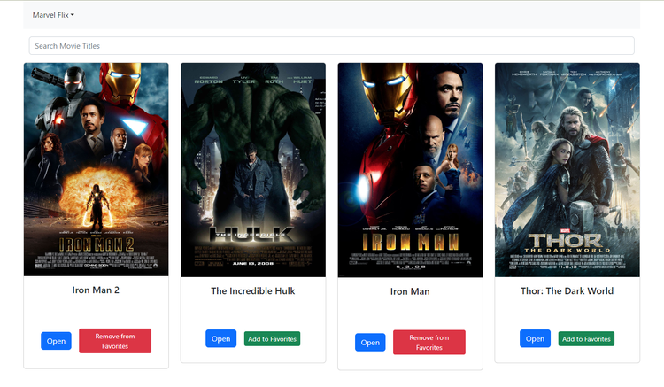

# myFlix React App: 

## Overview

`myFlix` is a single-page, responsive web application that serves movie enthusiasts, providing them with information about various movies. Built using the MERN (MongoDB, Express, React, and Node.js) stack, the client-side of the `myFlix` app supports its server-side counterpart by processing user requests and rendering responses via a series of interface views.

## Features

### Essential Views & Features:

- **Main View**:
  - Displays ALL movies (image, title, and description).
  - Features a search bar to filter movies.
  - Allows selection of individual movies for more details.
  - Supports user logout.
  - Navigation to Profile view.
- **Single Movie View**:
  - Showcases detailed data about an individual movie (description, genre, director, image).
  - Permits users to favorite a movie.
- **Login View**:
  - Supports user authentication via username and password.
- **Signup View**:
  - Handles new user registration (username, password, email, date of birth).
- **Profile View**:
  - Presents user's registration details.
  - Allows users to update their personal info.
  - Displays list of favorite movies.
  - Enables users to remove movies from their favorites.
  - Provides option for account deregistration.

### Optional Views & Features:

(These are enhancements that may or may not be present based on development choices.)

- **Actors, Genre, Director Views**: Display detailed information about actors, genres, and directors, respectively.
- **Single Movie View Enhancements**:
  - Show actor details.
  - Display additional movie details (e.g., release date, rating).
  - Provide genre descriptions and director bios via tooltips.
  - Sharing feature for movies.
  - List of related or similar movies.
- **Main View Enhancements**:
  - Option to sort movies based on various criteria.
- **Additional Lists**:
  - "To Watch" list in addition to the "Favorite Movies" list.

## Technical Stack

- **Frontend**: React (SPA), Bootstrap (UI Library), ES2015+.
- **Backend**: Express.js, Node.js with a MongoDB database.
- **Build Tool**: Parcel.
- **State Management**: React Redux (for features like movie filtering).

## Project Insights

### Design Philosophy

The transition from server-side rendering to the prominence of client-side development has revamped the way users interact with web applications. With this project, we embraced the power of React to build a fluid, interactive interface, ensuring a seamless user experience.

### User Stories

- **Information Access**: Users can fetch details about movies they've seen or are curious about.
- **Personal Profiles**: Users can curate a personal space where they save their favorite movies and manage their profile details.

## Access

The `myFlix` app is hosted online, optimized for various devices to ensure a consistent user experience. Dive into the world of movies [here](https://myflix-horban.netlify.app/login).

